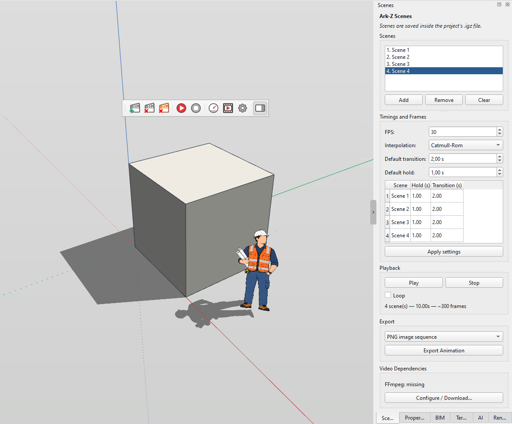

# IngeTrazo Extension — "Ark-Z Scenes" (Scene Manager)

A **toolbar** and a **side panel** for [IngeTrazo](https://github.com/ingelibre/ingetrazo)
that turn camera positions into an ordered list of **scenes** (camera
keyframes), play them back as a smooth camera **animation**, and **export**
the result as a PNG image sequence or an MP4 video.

- **Author:** Ezequiel M. Rezende
- **Date:** 2026-10-07
- **Version:** 1.0.0
- **License:** [GPL-3.0-or-later](https://www.gnu.org/licenses/gpl-3.0.html)
  (same as IngeTrazo — see [LICENSE](https://github.com/ingelibre/ingetrazo/blob/main/LICENSE))

---



*The **Scenes** toolbar and the **Cenas** side panel. (Screenshot to be added
before publishing.)*

---

## Files

```
<plugins>/
├── igz_tb_scenes.py         # the whole extension
├── README.md                # this file
├── README_ptBR.md           # Portuguese version
├── LICENSE                  # full GPL-3.0 text
├── THIRD-PARTY.md           # third-party notices
└── icons/
    ├── scene_add.svg              / scene_add_light.svg
    ├── scene_remove.svg           / scene_remove_light.svg
    ├── scene_remove_all.svg       / scene_remove_all_light.svg
    ├── scene_play.svg             / scene_play_light.svg
    ├── scene_stop.svg             / scene_stop_light.svg
    ├── scene_configure.svg        / scene_configure_light.svg
    ├── scene_export.svg           / scene_export_light.svg
    ├── scene_ffmpeg.svg           / scene_ffmpeg_light.svg
    └── scene_panel.svg            / scene_panel_light.svg
```

`igz_tb_scenes.py` is a **standalone single-file plugin**: it defines
`setup(app)`, so it works when dropped directly into the plugins folder.
The catalog build wraps it in a one-folder `.zip` (see
[Installation](#installation)).

---

## The "Scenes" Toolbar

Each button captures or plays back camera keyframes. A keyframe stores the
camera **eye** (position), **target** and **fov** (field of view); the panel
adds the per-scene **hold** (how long it stays) and **transition** (how long
it takes to move to the next one).

| Button                         | Icon               |
|--------------------------------|--------------------|
| **Adicionar Cena Atual**       | `scene_add`        |
| **Remover Cena Selecionada**   | `scene_remove`     |
| **Limpar Cenas**               | `scene_remove`     |
| **Tocar Animação de Cenas**    | `scene_play`       |
| **Parar Animação**             | `scene_stop`       |
| **Configurar Tempos e Quadros**| `scene_configure`  |
| **Exportar Animação**          | `scene_export`     |
| **Dependências de Vídeo***     | `scene_configure`  |
| **Painel de Cenas** (toggle)   | `scene_panel`      |

\* The **Dependências de Vídeo** button only appears when FFmpeg cannot be
found; with FFmpeg present the MP4 export already works.

The toolbar is added to the **top** toolbar area (`igz_tb_scenes`), and the
icons follow the light/dark UI palette (each icon has a `_light` variant).

---

## The "Cenas" Side Panel

The panel is inserted as a **tab** next to IngeTrazo's own side panels
(Propriedades / BIM / Terreno / Renderizar / IA) when the host allows it,
falling back to its own dock ("Cenas") otherwise. It uses draggable
splitters:

- **Cenas** — the list (fixed at 5 visible rows) plus **Adicionar**,
  **Remover** and **Limpar**.
- **Reprodução** — **Tocar**, **Parar**, a **Repetir em loop** checkbox and
  a live duration / frame-count label.
- **Tempos e Quadros** — FPS, interpolation, default transition, default
  hold, a per-scene table (fixed at 4 visible rows) and **Aplicar
  configuração**.
- **Exportação** — format (PNG sequence / MP4) and **Exportar Animação**.
- **Dependências de Vídeo** — the FFmpeg status and a **Configurar /
  Baixar…** button.

The **Painel de Cenas** toolbar button shows/hides the panel (a dock
`toggleViewAction`, or a "go to the Cenas tab" action).

---

## Scenes, the `.igz` file and preferences

- **Scenes belong to the project.** They are saved **inside** the `.igz`
  document (`app.set_document_data`), so they travel with the file and
  participate in undo/redo. Opening or creating a document reloads them.
- **Preferences** — FPS, interpolation, loop, default transition/hold and
  export size — are stored in `config.json` under the app data folder
  (`.../igz_tb_scenes/config.json`), so new projects start with your usual
  values.

---

## Camera interpolation

Three modes are offered under **Interpolação**:

- **Suave** — smoothstep (ease in/out).
- **Linear** — constant speed.
- **Catmull-Rom** — a spline through the keyframes, for organically curving
  camera paths.

---

## Export

**Exportar Animação** asks for format, FPS and **output size** (with a
"keep screen aspect" lock and a "current screen size" reset), then renders
each frame by grabbing the framebuffer:

- **Sequência de Imagens PNG** — writes `scene_00000.png`, … to a folder.
  No external dependency.
- **Vídeo MP4** — renders PNG frames to a temp folder and muxes them with
  **FFmpeg** (`libx264`, `yuv420p`, even dimensions). Needs FFmpeg; the
  plugin finds it in the saved path, on the `PATH`, in its local data
  folder, or in common locations, and can **download** a build on request
  (**Configurar / Baixar…**).

FFmpeg is optional and **not bundled** — see
[THIRD-PARTY.md](THIRD-PARTY.md).

---

## Relationship with `igz_tb_camera`

This is an **independent** extension: it does **not** modify `igz_tb_camera`
(`OrbitPickerTool`, `ZAxisOverlay`, orbits/helix, Z adjustment all stay
there). It only reuses the *pattern* of capturing `eye`/`target`/`fov` and
grabbing frames. Both can be installed at the same time.

---

## Compatibility

- **IngeTrazo 0.5.7** (the version this was tested with).
- **PySide6 / Qt 6** — the plugin is pure Python; it uses the in-app
  viewport camera and the grabbable framebuffer.
- Windows-first (the FFmpeg download points at Windows builds), but the
  toolbar, panel and PNG export are cross-platform.

### Language & internationalization

The toolbar tooltips and the panel labels are currently written in
**Portuguese** (`Adicionar`, `Tocar`, …), unlike the *Styles/Shadows*
toolbar which mirrors IngeTrazo's translatable menu strings. Making these
labels translatable is listed under
[Future improvements](#future-improvements-optional).

---

## Fragile points (things that depend on the host)

- **Main window / viewport discovery** — `setup(app)` locates the main
  window through `QApplication.topLevelWidgets()` or `app` attributes, and
  the viewport by class name. Unusual hosts may need adjustments.
- **Panel attachment** — the dock/tab "host" is found heuristically (it
  looks for a tab group titled Propriedades/BIM/Terreno/Renderizar/IA). If
  nothing matches, the panel falls back to its own dock.
- **Camera attribute names** — `eye()`, `target`, and `fov_deg` / `fov` /
  `field_of_view` are probed defensively.

### If the 0.x API breaks

The integration points are intentionally small: `setup(app)`, camera
read/write, `app.document_data` / `set_document_data`, `on_document_changed`
and `viewport.flash_status`. If a future IngeTrazo changes them, only those
small helpers in `igz_tb_scenes.py` need updating.

---

## Installation

### Manual (scripts / development)

1. In IngeTrazo, run **Extensões ▸ Abrir pasta de plugins** (or open the
   per-user plugins folder: `%APPDATA%\IngeTrazo\plugins\` on Windows,
   `~/.local/share/ingetrazo/plugins/` on Linux).
2. Create a folder named **`igz_tb_scenes`** inside it.
3. Copy **`igz_tb_scenes.py`**, the **`icons/`** folder and the **package
   entry** (`packaging/igz_tb_scenes/__init__.py`, renamed to `__init__.py`)
   into it.
4. Restart IngeTrazo. The **Scenes** toolbar appears in the top area and the
   **Cenas** panel joins the side panels.

> The folder **must** contain an `__init__.py` that loads `igz_tb_scenes.py`
> (the one in `packaging/igz_tb_scenes/`). A missing or wrong entry point
> silently produces **no** toolbar and **no** panel.

### From the IngeTrazo extension catalog

Packaged for the community catalog at <https://ingetrazo.com/extensiones>
(repository <https://github.com/ingelibre/ingetrazo-extensions>), which
installs a single `.zip` holding one folder with an `__init__.py`. Build
that archive with `packaging/build_extension.ps1` (Windows) or
`packaging/build_extension.py` (any platform); it lands in
`dist/igz_tb_scenes.zip`. See [`PUBLISHING.md`](PUBLISHING.md).

---

## Usage

1. Move/rotate the camera to the view you want and click **Adicionar Cena
   Atual**. Repeat for every view.
2. Open the **Cenas** panel to fine-tune each scene's **Permanência** and
   **Transição**, choose the **FPS** and the **Interpolação**, and click
   **Aplicar configuração**.
3. Click **Tocar** to preview; **Parar** interrupts. Enable **Repetir em
   loop** for a looping preview.
4. Click **Exportar Animação**, choose **PNG** or **MP4**, set the size and
   confirm.
5. Everything is saved with the `.igz`; reopen the file and the scenes come
   back.

---

## Future improvements (optional)

None of these are required — the extension works as-is.

1. **Translatable labels** — route the toolbar/panel strings through the
   host's `core.i18n` instead of hard-coded Portuguese.
2. **`Tool` subclass** — a "Scenes…" entry in the **Extensions** menu with a
   shortcut, so the user can reopen the toolbar if it is closed.
3. **Migrate to `app.add_panel(...)`** for full API compliance (integrate
   natively with the side tray instead of the heuristic host search).
4. **Per-scene easing** — a curve selector per keyframe.
5. **In-viewport timeline** — a scrubber and "add current" shortcut.

---

## License

GPL-3.0-or-later — the same license as IngeTrazo.
Third-party notices are recorded in [THIRD-PARTY.md](THIRD-PARTY.md).

See <https://www.gnu.org/licenses/gpl-3.0.html>.

Copyright (C) 2026 Ezequiel M. Rezende.

This program is free software: you can redistribute it and/or modify it
under the terms of the GNU General Public License, version 3 or later,
as published by the Free Software Foundation.

This program is distributed in the hope that it will be useful, but
**without any warranty**; without even the implied warranty of
**merchantability** or **fitness for a particular purpose**. See the
GNU General Public License for more details.
